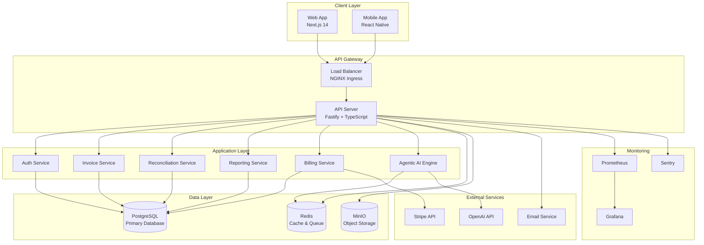
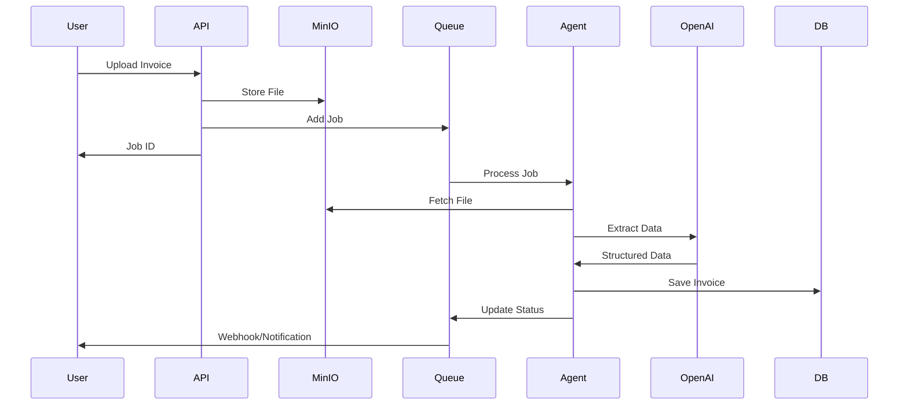
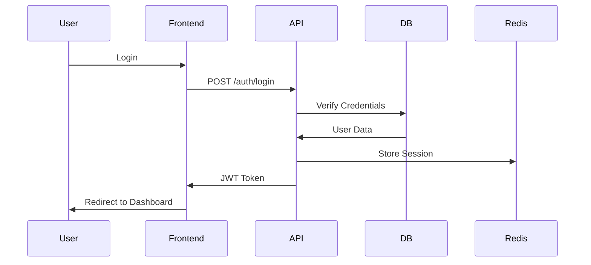

# AUDITRON System Architecture

## Overview

AUDITRON is a cloud-native, AI-powered accounting automation platform built with a microservices-inspired architecture, designed for scalability, reliability, and performance.

---

## High-Level Architecture



---

## Component Details

### Frontend (Next.js 14)

**Technology**: React 18, Next.js 14 App Router, TypeScript, Tailwind CSS

**Features**:
- Server-side rendering (SSR)
- Static site generation (SSG)
- API routes for BFF pattern
- Optimistic UI updates
- Real-time updates via WebSocket

**Deployment**: Vercel / CloudFlare Pages

### Backend API (Fastify)

**Technology**: Node.js 20, Fastify 4, TypeScript

**Features**:
- RESTful API design
- JWT authentication
- Role-based access control (RBAC)
- Rate limiting
- Request validation (Zod)
- Swagger documentation

**Deployment**: Kubernetes (3-10 replicas with HPA)

### Database (PostgreSQL 15)

**Schema**:
- Users & Organizations
- Invoices & Transactions
- Reconciliation Matches
- Agent Jobs & Logs
- API Keys & Invites

**Features**:
- ACID compliance
- Full-text search
- JSON columns for metadata
- Optimized indexes
- Connection pooling (Prisma)

**Deployment**: Managed PostgreSQL (AWS RDS / Google Cloud SQL)

### Cache & Queue (Redis 7)

**Use Cases**:
- Session storage
- API response caching
- Rate limiting counters
- Job queue (BullMQ)
- Real-time pub/sub

**Deployment**: Managed Redis (AWS ElastiCache / Google Memorystore)

### Object Storage (MinIO)

**Use Cases**:
- Invoice file uploads
- Report exports (PDF, Excel)
- Profile pictures
- Backup storage

**Deployment**: MinIO cluster / S3-compatible storage

### Agentic AI Engine

**Components**:
- **Orchestrator**: Workflow coordination
- **Agents**: Specialized AI workers
  - Invoice Extraction Agent
  - Categorization Agent
  - Reconciliation Agent
  - Compliance Agent
  - Reporting Agent

**Technology**: OpenAI GPT-4, LangChain patterns

**Features**:
- Stateless agent design
- Retry with exponential backoff
- Circuit breakers for external APIs
- Structured logging

---

## Data Flow

### Invoice Processing Flow



### Authentication Flow



---

## Scaling Strategy

### Horizontal Scaling

**API Servers**: 3-10 replicas (auto-scaling based on CPU/memory)

**Database**: Read replicas for reporting queries

**Cache**: Redis cluster with sharding

**Queue Workers**: 2-5 workers (auto-scaling based on queue length)

### Vertical Scaling

**Database**: Scale up instance size as data grows

**Cache**: Increase memory allocation

---

## Security Architecture

### Defense in Depth

1. **Network Layer**
   - VPC isolation
   - Security groups
   - WAF (Web Application Firewall)

2. **Application Layer**
   - JWT authentication
   - RBAC authorization
   - Input validation
   - Rate limiting
   - CORS policies

3. **Data Layer**
   - Encryption at rest (AES-256)
   - Encryption in transit (TLS 1.3)
   - Database access controls
   - Secrets management (Vault/KMS)

4. **Monitoring Layer**
   - Audit logging
   - Intrusion detection
   - Anomaly detection

### Secrets Management

- **Development**: `.env` files (gitignored)
- **Staging/Production**: Kubernetes Secrets + AWS Secrets Manager

---

## Disaster Recovery

**RTO**: < 1 hour  
**RPO**: < 15 minutes

**Backup Strategy**:
- Database: Daily full + hourly incremental
- Files: Hourly sync to S3
- Config: Git version control

**DR Site**: Cross-region replication (us-east-1 → eu-west-1)

See [DISASTER_RECOVERY.md](DISASTER_RECOVERY.md) for details.

---

## Monitoring & Observability

### Metrics (Prometheus)

- Request rate, duration, errors
- Database query performance
- Queue length and processing time
- Agent execution metrics
- Business KPIs (invoices processed, etc.)

### Logging (Pino + CloudWatch)

- Structured JSON logs
- Request ID tracking
- Sensitive data redaction
- Log aggregation and search

### Tracing (Sentry)

- Error tracking
- Performance monitoring
- Release tracking
- User feedback

### Dashboards (Grafana)

- API performance
- Database health
- Queue status
- Business metrics

---

## Technology Stack

### Backend

| Component | Technology | Version |
|-----------|-----------|---------|
| Runtime | Node.js | 20 LTS |
| Framework | Fastify | 4.x |
| Language | TypeScript | 5.x |
| ORM | Prisma | 5.x |
| Validation | Zod | 3.x |
| Queue | BullMQ | 5.x |
| Testing | Jest | 29.x |

### Frontend

| Component | Technology | Version |
|-----------|-----------|---------|
| Framework | Next.js | 14.x |
| UI Library | React | 18.x |
| Language | TypeScript | 5.x |
| Styling | Tailwind CSS | 3.x |
| Animation | Framer Motion | 11.x |
| Testing | Playwright | 1.x |

### Infrastructure

| Component | Technology | Version |
|-----------|-----------|---------|
| Container | Docker | 24.x |
| Orchestration | Kubernetes | 1.28 |
| Database | PostgreSQL | 15 |
| Cache | Redis | 7 |
| Storage | MinIO / S3 | - |
| Monitoring | Prometheus | 2.x |
| Visualization | Grafana | 10.x |

---

## Deployment Architecture

### Kubernetes Cluster

```
Production Cluster (us-east-1)
├── Namespace: auditron
│   ├── Deployment: auditron-api (3-10 replicas)
│   ├── Deployment: auditron-worker (2-5 replicas)
│   ├── Service: auditron-api (ClusterIP)
│   ├── Ingress: auditron-ingress (NGINX)
│   ├── HPA: auditron-api-hpa
│   └── ConfigMap/Secrets
├── Namespace: monitoring
│   ├── Prometheus
│   ├── Grafana
│   └── Alertmanager
└── Namespace: data
    ├── PostgreSQL (StatefulSet)
    ├── Redis (StatefulSet)
    └── MinIO (StatefulSet)
```

---

## Performance Characteristics

### Target SLAs

- **Availability**: 99.9% (43 minutes downtime/month)
- **Response Time**: p95 < 200ms
- **Error Rate**: < 0.1%
- **Throughput**: 1000 req/s

### Capacity Planning

- **Users**: 10,000 concurrent
- **Invoices**: 1M/month processing
- **Storage**: 1TB/year growth
- **Database**: 100GB current, 500GB capacity

---

## Future Enhancements

### Phase 6 (Q2 2025)

- [ ] GraphQL API
- [ ] WebSocket real-time updates
- [ ] Mobile app (React Native)
- [ ] Multi-tenancy improvements

### Phase 7 (Q3 2025)

- [ ] Machine learning models (custom)
- [ ] Advanced analytics
- [ ] Workflow automation
- [ ] Third-party integrations

### Phase 8 (Q4 2025)

- [ ] Multi-region deployment
- [ ] Edge computing
- [ ] Blockchain integration
- [ ] Advanced AI features

---

**Last Updated**: 2025-01-15  
**Version**: 1.0  
**Maintained By**: Engineering Team
